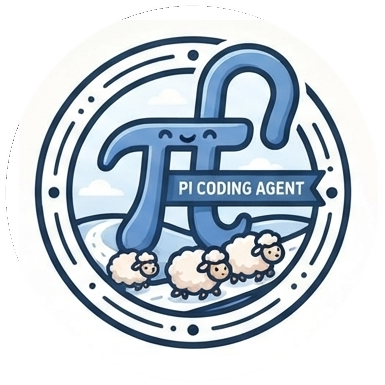
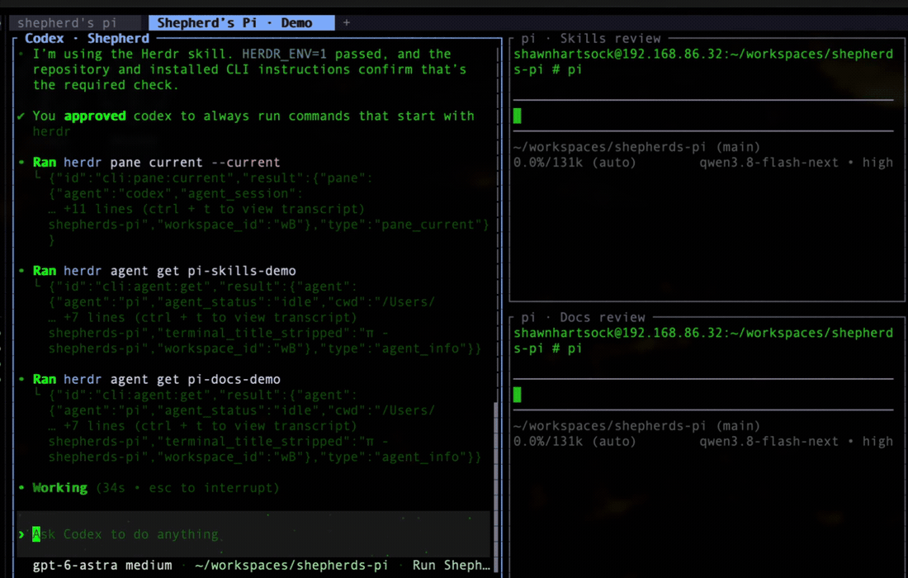

# Shepherd's Pi

  

## Combine Herdr and Pi

Like peanut butter and chocolate, herdr and pi are two great tastes that
taste great together. Herdr gives you the multiplexed panes and the
socket API to drive them; pi gives you a small, fast, model-agnostic agent
to put in each pane. A herdr tab full of idle `pi` panes is a flock — ready
for a shepherding agent to dispatch work into.

A skills repo, in the style of [ponytail](https://github.com/DietrichGebert/ponytail):
plain-text instructions for standing up a **[herdr](https://herdr.dev)**
workspace, wiring **[pi](https://github.com/earendil-works/pi)** to an
inference backend of your choice, and shepherding bounded parallel assignments
through artifact review, correction, and integration. Bring your own backend,
your own model, your own repo.

*Codex dispatches two pi helpers and reads their progress. Recorded at 2.5× speed.*

## Start shepherding

Install the [core skills](docs/installing.md), then use
[`shepherd`](skills/shepherd/SKILL.md) to turn a task into a checked result:

> Use shepherd to split this task into independent assignments for Pi helpers.
> Give each helper bounded ownership and acceptance checks, dispatch ready work
> together, inspect the artifacts, and integrate the result. Keep dependent
> work ordered and report any blocker.

Reuse a verified flock, or follow setup when one is needed. For an indivisible
small task, take the short serial path. See [worked assignments](docs/shepherding.md).

## What is Herdr?

Super TMUX. As in Terminal Multiplexer. You have one terminal with many
sub-terminals "multiplexed" together — an MCP server (and CLI) that agents
can use to pilot multiple shell programs: split panes, launch commands,
read output, wait for output, rename and label panes, all scriptable.
[github.com/herdrdev/herdr](https://github.com/herdrdev/herdr)

## What is Pi?

A minimalist agentic coding harness — [Pi Coding Agent](https://github.com/earendil-works/pi).
It is so minimal it is actually hard for a human to use. That minimalism
reduces distractions for the LLM inside it and makes it subtly more
effective: fewer built-in opinions, less ceremony, a smaller surface to
get confused by.

## In this repo

| Layer | Skills | Role |
|---|---|---|
| Core | [shepherd](skills/shepherd/SKILL.md), [herdr](skills/herdr/SKILL.md), [herdr-helpers-tab](skills/herdr-helpers-tab/SKILL.md) | Plan and conduct the work; control or prepare helpers when needed |
| Setup | [pi-install](skills/pi-install/SKILL.md), [pi-inference-backend](skills/pi-inference-backend/SKILL.md) | Install Pi and configure the chosen backend |
| Specialist guidance | [TDD](skills/tdd-red-green-blue/SKILL.md), [concision](skills/concision/SKILL.md), [three Cs](skills/three-cs/SKILL.md), [Unix philosophy](skills/unix-philosophy/SKILL.md), [cohesion](skills/functional-cohesion/SKILL.md) | Brief and review the relevant artifact |
| Optional terminal tooling | [tmux-drive](skills/tmux-drive/SKILL.md) | Drive other interactive TTY programs |

Install skills for the controlling agent. Workers receive focused briefs and
the relevant review criteria. Longer doctrine and the
[Pi configuration reference](docs/pi-config-reference.md) live in `docs/`.

## Installing the skills

The [installer](docs/installing.md) links the three core skill directories by
default and refuses collisions. Add setup or specialist skills by name, or
choose the full library explicitly. Keep this checkout available so linked
references and bundled tools remain accessible.

## License

MIT for everything authored in this repo — see [`LICENSE`](LICENSE).
`skills/tmux-drive` is mirrored from Shawn Hartsock's
[newt-agent](https://github.com/Gilamonster-Foundation/newt-agent) under its
Apache-2.0 license. `skills/herdr`, `skills/three-cs`, and
`skills/functional-cohesion` are adaptations under the same license. Source
notices identify changes; the doctrine references retain their attribution.

Model: GPT-6 | Harness: Codex | Operator: S Hartsock | Time: 00:51 EDT | Date: 2026-09-11

Model: GPT-6 | Harness: Codex | Operator: S Hartsock | Time: 00:59 EDT | Date: 2026-09-11
